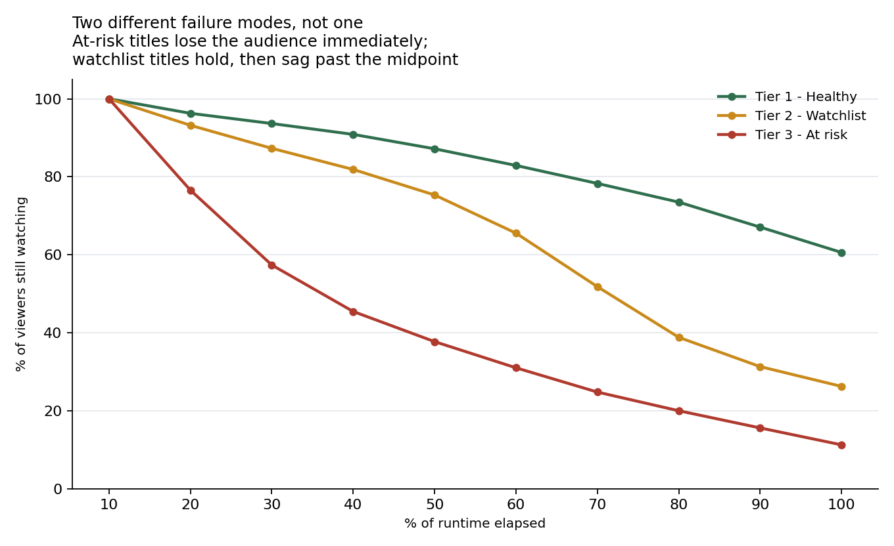

# Viewer Retention Diagnostic — OTT Platform

**A 33% catalogue completion rate is not one problem. It's two, and they need opposite fixes.**

A hypothesis-driven retention diagnostic over 9,249 viewing sessions across 40 titles. Segments the
catalogue into 3 risk tiers, then — the part that matters — separates titles that lose viewers in
the opening minutes from titles that hold them and lose them in the back half.


---

## Headline findings

| Risk tier | Titles | Avg completion | Licence spend | Dominant failure mode |
|---|---|---|---|---|
| 🟢 Tier 1 — Healthy | 14 | 60.8% | $74.9M | No single leak |
| 🟡 Tier 2 — Watchlist | 13 | 26.2% | $59.4M | **Pacing sag** (12 of 13) |
| 🔴 Tier 3 — At risk | 13 | 11.4% | $46.9M | **Hook failure** (12 of 13) |

- **At-risk titles lose 23% of viewers inside the first tenth of runtime.** By the 30% mark, 43% are
  gone. Nothing that happens later in these titles is reaching most of the audience.
- **Watchlist titles have the opposite shape.** They hold 82% of viewers to the 40% mark, then drop
  from 75% to 39% between the halfway and 80% points — the audience shows up, engages, and is lost
  in the middle.
- **It is not a device or UX problem.** Completion is flat across Smart TV, Mobile, Web and Tablet
  (32–36%), so the drop-off is in the content, not the player.
- **"Make everything shorter" is not supported.** Long films underperform short ones (26% vs 41%),
  but long series episodes *outperform* short ones (39% vs 33%). Runtime is not the lever.
- **$46.9M of licence spend sits in Tier 3**, where the median viewer does not reach the 30% mark.



Full query output: **[results/findings.md](results/findings.md)**

---

## The hypothesis

The platform's instinct was that completion is a content-quality problem and the answer is to
license better titles. The diagnostic tests a competing hypothesis:

> Low completion is not one phenomenon. Some titles fail to earn attention (a **hook** problem);
> others earn it and then lose it (a **pacing** problem). Averaging them into a single completion
> rate hides the distinction, and the two need different interventions.

If the hypothesis holds, the drop-off curves of the weakest and middle tiers should have visibly
different **shapes**, not just different heights. They do.

## The data

Synthetic, seeded, generated by [`scripts/generate_data.py`](scripts/generate_data.py).

| Table | Rows | Grain |
|---|---|---|
| `titles` | 40 | Genre, format, runtime, release date, licence cost |
| `viewing_sessions` | 9,249 | One row per session: % completed, drop-off decile, device |

Drop-off is recorded as a **decile of runtime** rather than a raw timestamp, which makes titles of
different lengths directly comparable — a necessity when a 40-minute episode and a 130-minute film
sit in the same catalogue.

## Method

All five queries live in
[`sql/02_retention_analysis.sql`](sql/02_retention_analysis.sql).

**`NTILE(3)`** does the tiering, so the split adapts to the catalogue rather than relying on a
hard-coded completion threshold that goes stale:

```sql
NTILE(3) OVER (ORDER BY completion_rate DESC) AS tier_rank
```

**A reverse-framed running sum** turns a drop-off histogram into a survival curve in one pass:

```sql
SUM(sessions_ending_here) OVER (
    PARTITION BY risk_tier
    ORDER BY dropoff_decile
    ROWS BETWEEN CURRENT ROW AND UNBOUNDED FOLLOWING)
```

**Conditional aggregation** produces the two competing failure signatures per title, which is what
makes the diagnosis mechanical rather than eyeballed:

```sql
AVG(CASE WHEN dropoff_decile <= 2       THEN 1.0 ELSE 0 END) AS early_abandon_rate,
AVG(CASE WHEN dropoff_decile BETWEEN 5 AND 8 THEN 1.0 ELSE 0 END) AS mid_abandon_rate
```

| Query | What it answers |
|---|---|
| Q1 | Title scorecard: completion, tier, failure mode, licence cost |
| Q2 | Survival curve by tier — the shape evidence for the hypothesis |
| Q3 | Runtime test: does length explain drop-off? |
| Q4 | Genre concentration and spend by genre |
| Q5 | Device control: content problem or UX problem? |

## Recommendations

1. **Tier 3 → product fix, not a content fix.** These titles lose the audience before the audience
   has seen the content. The leverage is in artwork, trailer, first-scene placement and
   recommendation surfacing, and it is cheap relative to re-licensing.
2. **Tier 2 → editorial fix.** Viewers commit and then leave mid-way. For series, that points at
   episode structure and act breaks; this is where a pacing review earns its keep.
3. **Stop treating runtime as the lever.** The data does not support a blanket shortening policy,
   and acting on it would damage the long-episode series that currently perform best.
4. **Gate renewal decisions on tier and failure mode.** A Tier 3 hook failure is potentially
   recoverable with merchandising. A Tier 3 title that also fails on pacing is not, and that is the
   renewal conversation to have first.

## Run it yourself

```bash
git clone https://github.com/YOUR-USERNAME/ott-retention-diagnostic.git
cd ott-retention-diagnostic
pip install -r requirements.txt

python scripts/generate_data.py   # builds data/retention.db
python scripts/run_analysis.py    # writes results/findings.md
python scripts/make_charts.py     # writes the survival-curve chart
```

## Repo structure

```
ott-retention-diagnostic/
├── sql/
│   ├── 01_schema.sql
│   └── 02_retention_analysis.sql   # the 5 analysis queries
├── scripts/
│   ├── generate_data.py
│   ├── run_analysis.py
│   └── make_charts.py
├── results/
│   ├── findings.md
│   └── survival_curves.png
└── .github/workflows/run.yml
```

## Caveats

- The dataset is **synthetic**. It is built to contain a real structural signal so the method can be
  demonstrated end to end; it does not represent any real platform's catalogue.
- Completion is defined as ≥90% of runtime watched. That threshold is a choice and a different one
  would move the tier boundaries.
- Sessions are treated independently. A real diagnostic would follow users across titles and
  sessions to separate title-level retention from platform-level retention.
- No causal claim is made. The tiers describe where viewers leave, not why.

## License

MIT
